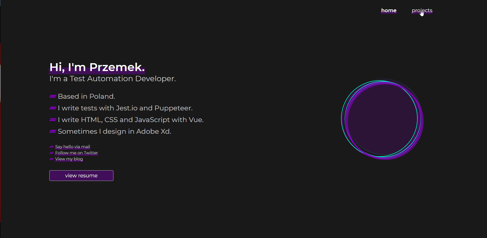

<h1 align="center">Portfolio</h1>
<h2 align="center"><a href="https://www.ppaczoski.pl">Click to visit!</a></h2>
<p align="center"><a href="https://app.netlify.com/sites/lucid-engelbart-901023/deploys"></a></p>
<h3 align="center">Personal website to introduce myself. My look over the design and developing. Made as a SPA with Mobile First design and page is fully responsive.</h3>
<p align="center"></p>

# Table of Contents

- [Set up locally](#set-up-locally)
- [Tech used](#tech-used)
- [License](#license)

<a id="set-up-locally"></a>

# :cloud: Set Up Locally

First:

```
npm install
```

Then to run locally on port:8080

```
npm run serve
```

Visit:

```
https://localhost:8080
```

<a id="tech-used"></a>

# :wrench: Tech used

<b>Designed in:</b>

- [Adobe Xd](https://www.adobe.com/pl/products/xd.html)

<b>Built with:</b>

- [Vue.js](https://vuejs.org)

<a id="license"></a>

# :scroll: License

MIT
